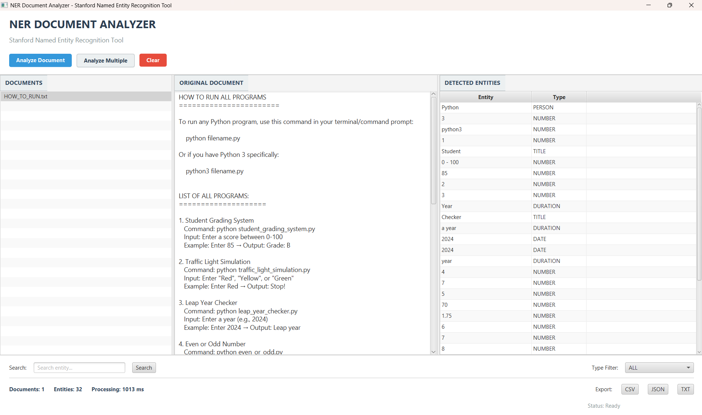

# NER Document Analyzer 


A powerful, academic-grade **Java Desktop Application** built to automatically detect and extract named entities (People, Organizations, Locations, Dates, etc.) from physical text documents using Stanford's advanced statistical NLP models. 

---

## Application Screenshot


---

## Key Features
* **Modern JavaFX Dashboard:** A clean, responsive desktop UI.
* **Stanford NER Engine:** Accurately extracts complex entities using robust pre-trained CRF (Conditional Random Field) models.
* **Smart Multi-Token Grouping:** Intelligently combines consecutive tokens (e.g. `Sundar` + `Pichai` becomes `Sundar Pichai` -> `PERSON`).
* **Batch Processing:** Load and analyze multiple `.txt` documents concurrently.
* **In-Memory Analytics:** Instantly filter entities by type (e.g. `ORGANIZATION`) or search for specific text matches.
* **Data Export:** Export your extracted NLP data to `.CSV`, `.JSON`, or `.TXT` formats in one click.

---

## Technology Stack
* **Language:** Java (JDK 17+)
* **UI Framework:** JavaFX 21.0.2
* **Build System:** Apache Maven
* **Core NLP Engine:** Stanford CoreNLP (4.5.3)
* **Serialization:** Jackson (JSON)
* **Testing:** JUnit 5

---

## How to Run the Project

Follow these simple steps to download and run the application on your computer.

### Prerequisites
1. You must have **Java 17** (or higher) installed.
2. You must have **Apache Maven** installed and added to your system's `PATH`.

### Step 1: Download the Project
1. Go to the top of this GitHub page.
2. Click the green **`<> Code`** button.
3. Select **`Download ZIP`**.
4. Extract the downloaded ZIP file to any folder on your computer.

### Step 2: Open Terminal
Open your Command Prompt or Terminal and navigate inside the extracted folder:
```bash
cd path/to/extracted/NER-DocAnalyzer-main
```

### Step 3: Launch the JavaFX Application!
Run the desktop GUI by executing:
```bash
mvn clean compile javafx:run
```
*(The first time you click "Analyze Document", it may take a few seconds to load the Stanford CoreNLP model into memory).*

### Alternative: Console Version
If you prefer to run the lightweight interactive terminal version without the GUI:
```bash
mvn exec:java -Dexec.mainClass=com.example.ner.Main
```

---

## Running Tests
The project features a highly comprehensive JUnit 5 test suite validating the NLP grouping and UI logic. Run them via:
```bash
mvn test
```

---

## Project Structure
```text
ner-document-analyzer/
├── pom.xml                      # Maven dependencies and JavaFX plugins
├── README.md                    # Project documentation
├── ACADEMIC_DOCUMENTATION.md    # Formal college/academic theoretical report
├── image.png                    # Put your UI screenshot here!
├── sample-documents/            # Demo documents to test the NER engine
├── src/
│   ├── main/java/com/example/ner/
│   │   ├── document/            # File reading and Batch logic
│   │   ├── export/              # CSV, JSON, TXT exporters
│   │   ├── model/               # Entity and DocumentResult data models
│   │   ├── ner/                 # Stanford CoreNLP Engine wrappers
│   │   ├── processing/          # Multi-token aggregation logic
│   │   ├── search/              # In-memory search and filter logic
│   │   ├── statistics/          # Analytical summary logic
│   │   └── ui/                  # JavaFX Controllers and MainApp
│   └── main/resources/
│       ├── main-view.fxml       # JavaFX XML Layout
│       └── styles.css           # JavaFX CSS Styling
```